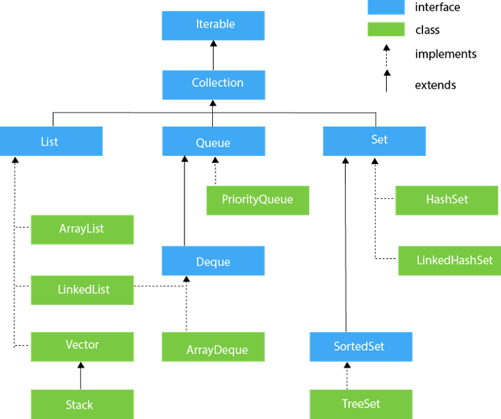

# 4주차

## 제네릭

제네릭 프로그래밍: 다양한 종류의 데이터를 처리할 수 있는 클래스와 메소드를 작성하는 기법

```java
class Box<T> {
    private T data;
    public void set(T data) { this.data = data; }
    public T get() { return data; }
}
```

```java
Box<String> b = new Box<String>();
Box<Integer> b = new Box<Integer>();
```

## 컬렉션

컬렉션은 객체들의 모임  
List, Stack, Queue, Set, HashTable 등

### Vector

Vector 클래스는 가변 크기의 배열(dynamic array)을 구현

```java
import java.util.Vector;

public class VectorTest {
	public static void main(String[] args) {
		Vector vc = new Vector();

		vc.add("Hello World!");
		vc.add(new Integer(10));
		vc.add(20);

		System.out.println("vector size: " + vc.size());

		for (int i=0; i<vc.size(); i++) {
			System.out.println("vector element " + i + ": " + vc.get(i));
		}
}
```



### 배열을 리스트로 변환

```java
List<String> list = Arrays.asList(new String[size]);

List list1 = Arrays.asList("abc", "def", "ghi", "jkl");
```

### 컬렉션 요소 반복

```java
for (int i=0; i<list.size(); i++) {
    System.out.println(list.get(i));
}
```

- for-each

```java
for (Integer i : list) {
    System.out.println(i);
}
```

- 람다식

```java
list.forEach(a -> { System.out.println(a); });
```

- 메소드 참조

```java
list.forEach(System.out::println);
```

- Iterator

```java
Iterator itr = list.iterator();
while (itr.hasNext()) {
    System.out.println(itr.next());
}
```

## 람다식

: 메소드를 객체로 취급할 수 있는 기능  
: 나중에 실행될 목적으로 다른 곳에 전달될 수 있는 코드 블록  

람다식을 이용하면 메소드가 필요한 곳에 간단히 메소드를 보낼 수 있다.  

### 람다식의 구문

```
(argument) -> (body)

(arg1, arg2 ...) -> { body }

(type1 arg1, type2 arg2 ...) -> { body }

(int a, int b) -> { return a + b; }
```

- 예

```java
() -> System.out.println("Hello");
(String s) -> { System.out.println(s); }
() -> 69
() -> { return 3.141592; }
```

- 버튼의 클릭 이벤트 처리 가능

```java
button.addActionListener((e) -> {
    System.out.println("버튼 클릭!");
});
```

### 메소드 참조

```java
Arrays.sort(rosterAsArray, (a, b) -> Person.compareByAge(a, b) );
Arrays.sort(rosterAsArray, Person::compareByAge);
```

- Static Method

```
(args) -> class.staticMethod(args)

Class::staticMethod
```

```java
public class MethodReference {
    public static void saySomething() {
        System.out.println("Hello");
    }
    public static void main(String[] args) {
        Sayable sayable = MethodReference::saySomething;
    }
}
```

- Instance Method

```
containingObject::instanceMethodName
```

```java
public class InstanceMethodReference {
    public void saySomething() {
        System.out.println("instance method");
    }
    public static void main(String[] args) {
        InstanceMethodReference methodReference = new InstanceMethodReference();
        Sayable sayable = methodReference::saySomething;
    }
}
```

### 카드 게임

```java
import java.util.ArrayList;

class Card {
	String shape;
	int num;
	
	public Card(String s, int n) {
		shape = s;
		num = n;
	}
	
	public String getShape() {
		return shape;
	}
	
	public int getNum() {
		return num;
	}
}

public class CardGame {
	public static void main(String[] args) {
		ArrayList<Card> card = new ArrayList<Card>();
		
		for (int i=1; i<=13; i++) {
			card.add(new Card("Spades", i));
			card.add(new Card("Clovers", i));
			card.add(new Card("Hearts", i));
			card.add(new Card("Diamonds", i));
		}

		for (int i=0; i<5; i++) {
			int r = (int)(Math.random()*card.size()) + 1;	// 난수 발생(1~52)
			Card c = card.get(r);
			String s = c.getShape();
			int n = c.getNum();
			String ns = Integer.toString(n);
			
			switch(n) {
			case 1:
				ns = "ACE";
				break;
			case 11:
				ns = "JACK";
				break;
			case 12:
				ns = "QUEEN";
				break;
			case 13:
				ns = "KING";
				break;
			}
			
			System.out.println(s + "의 " + ns);
		}
	}
}
```