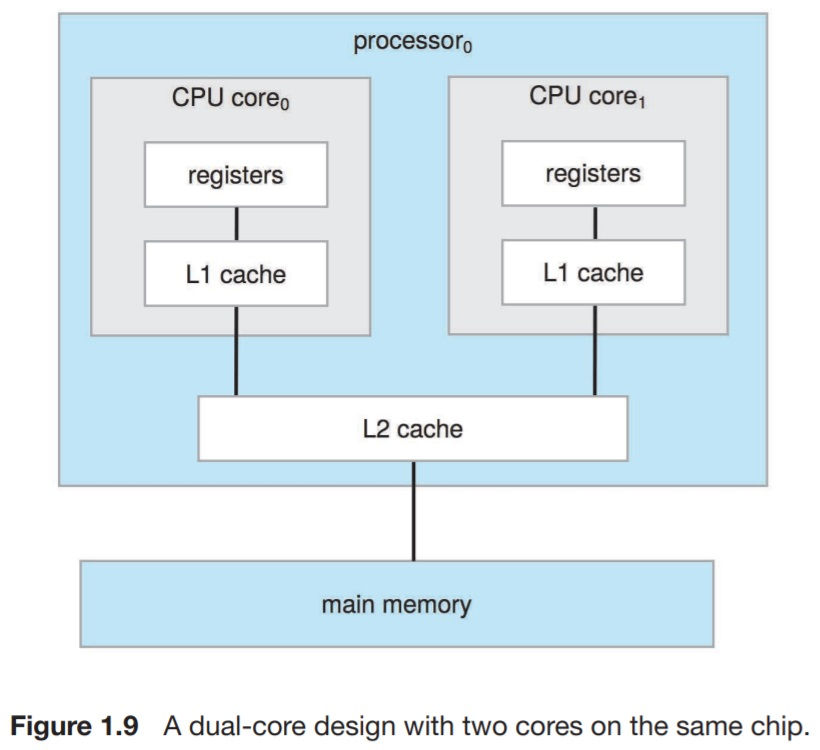

# Operating System

## 1. Introduction

### 운영체제(Operating System, OS)란?

- 운영체제  
    - 컴퓨터 하드웨어 __관리__
    - 사용자와 컴퓨터 하드웨어 사이의 __중재자__ 역할

- 운영체제 목표
    - 사용자 프로그램 실행
    - 사용자가 컴퓨터 시스템을 쉽고 편리하게 사용하여 문제 해결
    - 컴퓨터 하드웨어를 효율적으로 관리

### 컴퓨터 시스템 구성 요소

- 컴퓨터 시스템의 4가지 구성 요소
    - 하드웨어
        - 기본 계산 자원(computing resource) 제공
        - CPU, Memory, I/O device
    - 운영체제
        - 다양한 응용들 및 사용자들 간의 하드웨어 사용을 제어하고 중재
    - 응용 프로그램
        - 사용자의 계산 문제를 해결하기 위해 시스템 자원(system resource)들이 어떻게 사용될 것인지를 정의
        - 워드프로세서, 컴파일러, 웹브라우저, 데이터베이스 시스템, 비디오 게임 등
    - 사용자
        - 사람, 기계, 다른 컴퓨터 등

### 운영체제 정의

- 운영체제는 __자원 할당기(resource allocator)__
    - 모든 자원들을 관리하고 스케줄(schedule)
    - 서로 상충되는 요청들을 조정하여 효율적이고 공정하게 자원을 사용

- 운영체제는 __제어 프로그램(control program)__
    - 컴퓨터 부적절한 사용과 에러를 방지하도록 프로그램들의 실행을 제어

- 운영체제는 __커널(kernel)__
    - 컴퓨터 상에서 항상 실행되는 프로그램
        - 항상 메모리에 상주(memory resident)
    - 다른 프로그램들(시스템 프로그램 또는 응용 프로그램)은 운영체제에 종속

### 컴퓨터 구동(Startup)

- __부트스트랩 프로그램(boodstrap program)__
    - 전원이 켜지거나 재부팅될 때 실행되는 초기 프로그램
    - ROM이나 EEPROM에 저장
        - __펌웨어(firmware)__ 라고 함
    - 시스템의 모든 사항을 초기화
        - CPU 레지스터, 장치 제어기, 메모리 내용 등
    - 운영체제의 커널을 찾아 메모리에 적재하고 실행을 시작

### 컴퓨터 시스템 구조(Organization)

- 컴퓨터 시스템 연산(operation)
    - 공유 메모리에 접근 가능한 공통 버스에 연결된 하나 이상의 CPU와 여러 개의 장치 제어기(device controller)들로 구성  
    - CPU와 장치 제어기는 메모리 사이클을 얻기 위해 경쟁하면서 병행 수행(concurrent execution)  
  
    - 입/출력 장치들과 CPU는 병행 수행(concurrent execution)
    - 입/출력 장치 제어기(I/O device controller)
        - 특정 장치 타입에 대해 동작
        - 지역 버퍼(local buffer)를 가짐(data register)
    - CPU는 주 메모리(main memory)와 지역 버퍼들 사이에 데이터 송수신을 제어
    - 입/출력은 장치와 제어기의 지역 버퍼 사이 수행
    - 장치 제어기는 입출력 연산 종료 시 인터럽트(interrupt)을 사용하여 CPU에 알림

### 인터럽트(Interrupt) 소개

- CPU에 인터럽트 신호(signal)가 들어오면 실행 중인 작업을 멈추고 고정된 위치의 __인터럽트 서비스 루틴(interrupt service routine)__ 으로 이동하여 실행
    - __인터럽트 벡터(interrupt vector)__ 가 인터럽트 서비스 루틴들의 시작 주소에 관한 정보 제공
    - 실행 중인 작업 주소를 저장하여 서비스 루틴 종료 후 복귀
- 다른 인터럽트 처리 중에 새로이 요청되는 인터럽트는 승인 거부 될 수 있음
    - 인터럽트 우선순위에 따라 승인 또는 거부 결정
- __트랩(trap)__ 또는 __예외(exception)__ 는 에러 또는 사용자 요청에 기인한 소프트웨어가 생성한 인터럽트
- 운영체제는 인터럽트 기반으로 구동

### 인터럽트 처리(Interrupt Handling)

- 운영체제는 레지스터와 프로그램 카운터(PC)를 저장하여 실행 중인 __CPU 상태를 보존__
- 발생된 인터럽트의 형태를 파악
    - __폴링(polling)__
    - __백터 인터럽트__ 시스템
- 인터럽트의 형태에 따라 서로 다른 코드에 의해 적용되는 동작을 결정

### 입/출력 인터럽트 시간 일정(Time Line)

### 입출력 구조(I/O Structure)

- 입출력 명령을 실행하면 입출력 동작 종료 시에만 사용자 프로그램으로 제어 이동
    - 대기 명령(wait instruction)으로 다음 인터럽트까지 CPU는 쉼(idle)
    - 대기 루프(메모리 접근 충돌)
    - 한 번에 하나의 입출력 요청만 가능하고, 동시에 여러 입출력 처리할 수 없음
- 입출력 명령을 실행하면 입출력 동작 종료를 기다리지 않고 사용자 프로그램으로 리턴
    - __시스템 호출(system call)__
        - 사용자가 입출력 종료 시까지 기다리도록 운영체제에 요청
    - __장치-상태 테이블(device-status table)__
        - 각 입출력 장치의 타입, 주소, 상태 등을 저장
        - 운영체제는 장치의 상태 결정, 인터럽트 등을 포함한 테이블 엔트리 수정을 위해 입출력 테이블을 참조

### 저장 장치 구조(Storage Structure)

- 주 메모리(main memory)
    - CPU가 직접 접근 가능한 유일한 대량의 저장 장치
    - 주로 DRAM으로 구현하고 임의 접근(random access)
    - 일반적으로 휘발성(volatile)
- 보조 저장 장치(secondary storage)
    - 대용량의 비휘발성(nonvolatile) 저장 장치로 주 메모리를 확장
    - 자기 디스크(magnetic disk)
        - 디스크의 표면은 논리적으로 트랙(track)과 섹터(sector)로 분할
        - 디스크 제어기(disk controller)는 장치와 컴퓨터 간에 논리적인 상호 작용을 제어
    - Solid-State Disk(drive)
        - 자기 디스크보다 빠름, 비휘발성
        - 최근 많이 사용

### 저장 장치 계층(Hierarchy)

- 저장 장치는 계층으로 구성
    - 속도, 비용, 비휘발성
- 캐싱(caching)
    - 더 빠른 저장 장치로 정보를 복사
    - 주 메모리는 보조 저장 장치를 캐싱
- 운영체제는 각 장치 제어기마다 장치 드라이버를 내장
    - 장치 드라이버는 장치 제어기의 동작을 이해하고, 제어기와 커널 사이에 일관된 인터페이스 제공

### 캐싱(Caching)

- 컴퓨터의 여러 계층에서 사용되는 중요한 원칙
    - 하드웨어, 운영체제, 소프트웨어
- 더 느린 저장장치(원본)에서 사용 중인 정보의 부분을 더 빠른 저장장치로 복사
- 사용 중인 정보가 더 빠른 저장장치(캐시)에 있는지 조사
    - 있으면 정보는 캐시(더 빠른 저장 장치)로 부터 추출
    - 없으면 캐시로 복사한 후 추출
- 캐시의 크기는 원본의 저장장치보다 더 작음
    - 캐시의 관리가 중요
    - 캐시의 크기와 대체 정책(replacement policy)

### 직접 메모리 접근(Direct Memory Access, DMA)

- 인터럽트 구동 방식의 입/출력은 디스크 입/출력과 같은 대량의 데이터를 전송하는 데에는 높은 오버헤드(overhead)를 초래
- 직접 메모리 접근
    - 고속 전송이 가능한 입/출력 장치에 사용
    - 장치 제어기는 CPU의 개입 없이 메모리로부터 자신의 버퍼 장치로 또는 버퍼로부터 메모리로 데이터 블록 전체를 전송
    - 속도가 느린 장치처럼 한 바이트마다 인터럽트가 발생하는 것이 아니라 블록 전송이 완료될 때마다 인터럽트가 발생

### 컴퓨터 시스템 구조

- 단일 처리기 시스템(Single-Processor System)
    - 범용 처리기(processor, CPU)가 하나 있는 시스템
    - 디스크나 그래픽 제어기와 같은 특정 장치 처리기
- 다중 처리기 시스템(Multiprocessor System)
    - 다수의 처리기를 갖는 시스템
        - 병렬 시스템, 멀티코어 시스템이라고도 함
    - 주요 장점
        - 증가된 처리량(throughput)
        - 규모의 경제(economy of scale)
            - 각 처리기가 주변장치, 저장장치, 전원 등을 공유하여 비용 절감
        - 증가된 신뢰성(reliability)
    - 2가지 유형
        - 대칭적 다중 처리(symmetric multiprocessing, SMP)  
        
        - 비대칭적 다중 처리(asymmetric multiprocessing)  

### CPU 설계 최근 경향

- UMA vs NUMA 아키텍처
    - 균등, 비균등 메모리 접근(uniform, non-uniform memory access)
- 멀티칩(multi-chip) vs 멀티코어(multicore)
- 시스템에 모든 칩을 내장 vs 블레이드 서버(blade servers)
    - 블레이드 서버는 한 섀시(Chassis)에 다수의 처리기 보드, 입출력 보드, 네트워크 보드 등 장착
        - 각 처리기 보드마다 독립적인 운영체제 수행

### 클러스터형 시스템(Clustered System)

- 둘 이상의 독자적 시스템(노드)들을 연결하여 협력 동작
    - SAN(Storage-Area Network)를 사용하여 저장장치 공유하기도 함
    - 일부 노드(머신) 고장 시에도 동작 가능한 고가용성(high-availability) 제공
        - 비대칭 클러스터링(asymmetric clustering)
            - 다른 머신이 응용을 실행하는 동안 한 머신은 긴급-대기(hot-standby) 모드로 상태를 유지하고 동작 중인 머신(서버) 감시
            - 서버 중 하나가 고장나면 긴급 대기 모드의 서버가 활성화됨
        - 대칭 클러스터링(symmetric clustering)
            - 여러 노드들이 응용을 수행하고 서로 모니터링
    - 고성능 컴퓨팅을 위해서도 클러스터링 사용
        - 병렬 응용 프로그램을 작성해야함
    - 공유 데이터에 대한 서로 충돌되는 연산을 피하고 동기화가 필요한 클러스터에는 분산 잠금 관리자(distributed lock manager, DLM) 사용
- 최근에 빅데이터 저장 및 처리를 위해 클러스터 구성
    - 분산 파일 시스템 구성
    - HDFS(Hadoop Distributed File System)
    - MapReduce 병렬 처리

### 운영체제의 구조(OS Structure) - 다중 프로그래밍

- 다중 프로그래밍(multiprogramming)
    - 단일 사용자는 CPU 또는 입/출력 장치를 항상 바쁘게 유지할 수 없음
    - 다중 프로그래밍은 CPU가 수행할 작업(코드와 데이터)을 항상 하나는 가지도록 작업(job, process)을 구성
    - 운영체제는 한 번에 여러 작업을 메모리에 적재
    - 운영체제는 메모리 내에 있는 작업 중에서 하나를 선택해 실행
    - 선택된 작업이 입/출력의 종료를 기다리는 동안 운영체제는 다른 작업으로 전환해 수행

### 운영체제 구조 - 시분할(Time Sharing)

- 시분할(또는 멀티태스킹)은 다중 프로그래밍의 논리적 확장
    - CPU가 다수의 작업들을 매우 빈번하게 교대가 일어나기 때문에 프로그램이 실행되는 동안 사용자들은 각자 자기의 프로그램과 상호작용
    - 응답 시간(response time)이 짧아야 하며, 통상 1초
    - 각 사용자는 메모리에 최소한 하나의 프로그램을 가짐 => 프로세스(process)
    - 여러 개의 작업이 동시에 실행준비가 되어있으면, 시스템은 이들 중 하나를 선택 => CPU 스케줄링
    - 프로세스들이 모두 메모리에 놓일 수 없는 경우 스와핑(swapping)
        - 스와핑이란 필요에 의해 프로세스를 주 메모리에서 디스크로, 디스크에서 주 메모리로 옮기는 작업
    - 가상 메모리(virtual memory)를 사용하여 작업 전체가 아닌 메모리에 있는 일부만의 작업 수행을 허용

### 운영체제 연산(OS Operations)

- 운영체제는 인터럽트 구동식(interrupt driven)
- 트랩(trap) 또는 예외(exception)은 오류 또는 사용자 프로그램의 운영체제 서비스 수행 요청에 의해 유발되는 소프트웨어에 의해 생성된 인터럽트
    - 0으로 나누기 또는 유효하지 않은 메모리 접근
- 운영체제와 사용자는 컴퓨터 시스템의 하드웨어와 소프트웨어 자원을 공유하기 때문에 사용자 프로그램의 오류가 현재 수행중인 프로그램에만 문제를 일으키도록 보장해야함

### 운영체제 연산 - 이중 연산 모드

- 이중 연산 모드로 __운영체제 코드의 실행__ 과 __사용자 정의 코드의 실행__ 을 구분하여 운영체제를 보호
    - 사용자 모드(user mode), 커널 모드(수퍼바이저(supervisor) 모드, 시스템 모드, 특권 모드(privileged mode))
- 하드웨어가 모드 비트(mode bit) 제공
    - 커널 모드(0) 또는 사용자 모드(1)를 나타내는 비트
    - 시스템이 사용자 코드 또는 커널 코드 실행 여부를 구분
    - 일부 명령을 특권 명령(previleged instruction)으로 지정하여 커널 모드에서만 수행되도록 허용
- CPU의 다중 모드(multi-mode) 지원이 증가하는 추세
    - 예) 게스트 가상머신을 관리하는 가상머신 관리기를 위한 별도의 모드 비트

### 시스템 호출(System Call)

- 시스템 호출은 사용자 프로그램이 자신을 대신하여 운영체제가 수행하도록 예약되어 있는 작업들을 운영체제에게 요청
    - 시스템 호출 시 사용자 모드에서 커널 모드로 변경되고, 복귀 시 사용자 모드로 리셋

### 사용자 모드에서 커널 모드로 이동

- 무한 루프나 프로세스의 자원 독점을 방지하기 위해 타이머 사용(타이머 인터럽트)
    - 일정 시간 후에 인터럽트를 발생하도록 타이머 지정
    - 물리적인 클럭으로 감소되는 카운터 관리
    - 운영체제가 카운터 초기값 세트(특권 명령)
    - 카운터가 0이 되면 인터럽트 발생
    - 프로세스 스케줄링 전에 CPU 제어권을 다시 획득하기 위해서, 또는 할당된 시간을 초과하여 실행하는 프로그램을 종료하기 위해 설정

### 프로세스 관리(Process Management)

- 프로세스는 실행 중인 프로그램
    - 시스템의 작업 단위
    - 프로그램은 수동적 개체(passive entity)
    - 프로세스는 능동적 개체(active entity)
- 프로세스는 자신의 일을 수행하기 위해 CPU 시간, 메모리, 파일, 그리고 입/출력 장치를 포함한 여러가지 자원이 필요
    - 프로세스 종료 시 사용 중인 자원들을 해제(반납)
- 단일 스레드 프로세스는 다음 수행할 명령을 지정하는 하나의 프로그램 카운터를 가짐
    - 다중 스레드 프로세스는 복수 개의 프로그램 카운터를 가짐
- 일반적으로 시스템에서는 여러 프로세스가 동작 중
    - 일부는 운영체제 프로세스들
    - 단일 CPU 코어에서 멀티플렉싱하거나(__병행 실행__), 여러 CPU 코어들에서 __병렬 실행__
- 운영체제는 프로세스 관리와 연관해 다음과 같은 활동에 대한 책임
    - CPU에 프로세스와 스레드를 스케줄하기
    - 사용자 프로세스와 시스템 프로세스의 생성과 제거
    - 프로세스의 일시 중지와 재수행
    - 프로세스 동기화(synchronization)를 위한 기법 제공
    - 프로세스 통신을 위한 기법 제공
    - 교착상태(deadlock) 처리를 위한 기법 제공

### 메모리 관리(Memory Management)

- 메인 메모리는 CPU와 입/출력 장치에 의하여 공유되는, 빠른 접근이 가능한 데이터의 저장소
- 실행되는 모든 명령들과 데이터는 메모리 내에 상주
    - 폰 노이만 방식 컴퓨터
- 메모리 관리는 CPU 이용률과 사용자 응답률을 최적화하는 관점에서 메모리에 놓일 프로세스를 결정
- 운영체제는 메모리 관리와 관련하여 다음과 같은 일을 담당
    - 메모리의 어느 부분이 현재 사용되고 있으며 누구에 의해 사용되고 있는지를 __추적__
    - 어떤 프로세스(또는 그 일부)들을 메모리에 __적재__ 하고 __제거__ 할 것인가를 결정
    - 필요에 따라 메모리 공간을 __할당(allocation)__ 하고 __회수(release)__